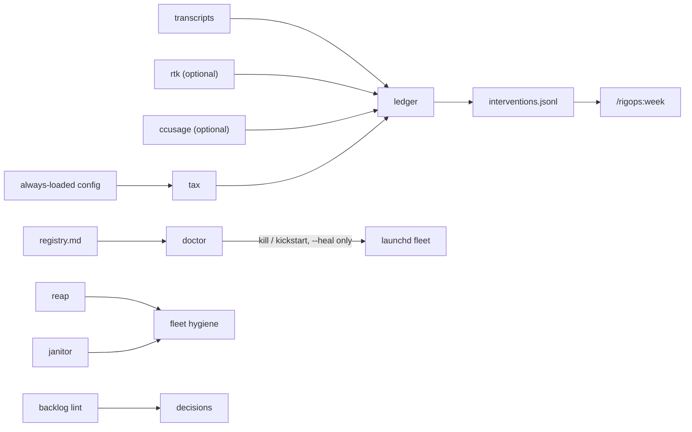

# rigops

Ops layer for a long-running agent rig - the surrounding system of instructions, hooks, automation, tooling, and state that supports long-running coding agents.

You tweak that rig constantly: a leaner prompt, a new hook, a stricter permission gate. rigops exists to answer one question about every tweak - **did it actually work?**

```bash
rigops ledger                               # measure: weekly effort baseline
rigops ledger note "trimmed system prompt"  # intervene: record what changed
rigops ledger diff                          # judge: before vs. after
```

Everything else in the repo - context-tax tracking, automation-fleet doctor, workspace hygiene - exists to support that loop.

> **Status:** first public cut - v0.3.0, extracted from a working rig.

## Positioning

`ccusage` tells you what you spent; rigops tells you whether the change you made last week worked.

Existing tools focus on spend and point-in-time audits. rigops focuses on week-over-week intervention tracking, config regrowth over time, and launchd/cron automation-fleet health for agent rigs.

rigops is not:

- A spend dashboard. That's `ccusage`'s job.
- An agent framework. It operates the rig around your agents; it doesn't run them.
- A dotfiles dump. One JSON config, not a pile of scattered shell exports.

## Safety

Read this before the loop docs below. Several of these commands change or delete things on disk, or send signals to running processes.

- `rigops doctor --heal` can `SIGTERM`/`SIGKILL` an entire hung-job process group. Without `--heal`, `doctor` only reports.
- `rigops reap --apply` removes git worktrees. Without `--apply`, `reap` only lists what it would remove.
- `rigops janitor --apply` deletes files that match your retention rules. Without `--apply`, `janitor` is a dry run.
- `install.sh` changes nothing on your machine unless you pass `--apply`.

Everything else is read-only, report-only, or plan-only by default, and the destructive paths carry their own caps on top of that: `reaper.max_kills_per_tree` refuses to touch a worktree once too many processes match under it, `janitor.max_delete` bounds how much a single run can remove, and both fail closed rather than guess. `rigops reap --selftest` exercises the kill path against disposable processes it spawns itself, so you can confirm process-group isolation before pointing it at anything real.

Full writeup: [docs/SAFETY.md](docs/SAFETY.md).

## Map

How data moves from raw agent transcripts to a weekly decision:



## The four loops

### 1. Measure, intervene, diff

`rigops ledger` writes one append-only row a week: cost, latency, cache behavior, intervention count - whatever effectiveness levers matter for the rig. `rigops ledger note` records an intervention next to the week it happened: a prompt change, a new hook, a pruned rule. `rigops ledger diff` then shows week-over-week deltas per column, annotated with the interventions that landed between the two rows, so "did that help" gets an answer instead of a guess.

One column worth defining once: EIT (effective input tokens) = input + 1.25 × cache_creation + 0.1 × cache_read. It's the ledger's cost proxy - cache writes and reads aren't free, and weighting them lets a cache-heavy week compare fairly against a cache-cold one.

```text
ledger diff: 2026-08-10 -> 2026-08-17
column               old       new       delta     pct
-------------------  --------  --------  --------  -------
agent_per_100        6.3       11.8      5.5       +87.6%
cache_hit_pct        71.4      76.9      5.5       +7.7%
cheap_model_eit_pct  11.2      23.6      12.4      +110.7%
ctx_mean             189000    151000    -38000    -20.1%
ctx_p50              212.0k    168.0k    -44.0k    -20.8%
eit_per_turn         41.0k     29.2k     -11.8k    -28.8%
eit_per_turn_30d     38.2k     35.6k     -2.6k     -6.8%
eit_total            16892000  11592400  -5299600  -31.4%
fixed_tax_b          136.0 KB  87.0 KB   -49.0 KB  -36.0%
out_per_turn         1450      1290      -160      -11.0%
over300k_pct         34.2      18.7      -15.5     -45.3%
sessions             38        41        3         +7.9%
turn1_p10            78.0k     41.0k     -37.0k    -47.4%
turn1_p50            92.0k     44.5k     -47.5k    -51.6%
turns                412       397       -15       -3.6%

Interventions in this window:
2026-08-12  pruned always-loaded rules: moved the code-search runbook to an on-demand reference
2026-08-13  turned on ctx-nudge tiers; long sessions now get restarted at the 350k nudge
2026-08-14  mechanical multi-file edits now go to a cheap-model subagent by default
```

### 2. Context tax

Every rig pays a fixed tax on top of whatever a turn actually needs: the bytes of always-loaded config - `CLAUDE.md`, rules, always-on skill text - get loaded on every single turn, whether that turn touches them or not. `rigops tax` breaks that tax down file by file. `rigops tax --history` tracks the same total across the ledger's history, so regrowth after a pruning pass shows up as a trend instead of staying invisible until the rig just feels slow again.

```text
file                             size
-------------------------------  -------
~/.claude/CLAUDE.md              40.8 KB
~/.claude/rules/git-workflow.md  17.8 KB
~/.claude/rules/code-style.md    11.8 KB
~/.claude/rules/testing.md       9.2 KB
~/.claude/rules/security.md      7.4 KB
total: 87.0 KB
```

```text
▂▃▄▅▆▇█▁
first 2026-06-29: 97.0 KB
last  2026-08-17: 87.0 KB
delta: -10215 B (-10.3%)
```

### 3. Fleet doctor

The registry (`registry.md`) is plain markdown: one entry per automated job, with its cadence, its evidence file, and how long it's allowed to run before it counts as hung. `rigops doctor` reads it and judges each job - stale against its declared cadence, hung against `max_runtime_h`, cooling down after a repeated heal so a flapping job doesn't get restarted into the ground. It's report-only by default; `--heal` opts into the kill/kickstart side effects, and `--supervisor none` skips `launchctl` entirely on hosts that don't run launchd.

```text
rigops doctor report 2026-08-23T10:53:12Z
supervisor: none

== jobs ==
id              status  runtime  evidence age  action
--------------  ------  -------  ------------  ------
nightly-backup  ok      -        2.0h          none
metrics-rollup  stale   -        72.0h         none
not judged (no launchd label, no evidence): log-prune

== checks ==
name          status  detail
------------  ------  -----------------
backup-fresh  ok      exit 0
disk-free     ok      400.2GB free on ~
```

### 4. Hygiene

`rigops reap` removes git worktrees whose branch has already merged or died. `rigops janitor` applies declarative retention rules instead of ad hoc `rm` one-liners. `rigops backlog lint` enforces one-line grammar on the backlog file so it stays a queue instead of a dumping ground.

```text
~/projects/tools/demo  (target: main)
  reap                  0d  landed-fix                         landed-fix  8.0K
  skip: dirty           0d  wip-feature                        wip-feature

totals: reap=1  skip: dirty=1
reclaimable: 8.0K (apparent size; copy-on-write means actual is lower)
```

## Quickstart

### Plugin only - thirty seconds, zero daemons

In Claude Code:

```text
/plugin marketplace add xantorres/rigops
/plugin install rigops@rigops
```

This installs the commands, skills, and hooks. It degrades gracefully if the CLI half below isn't installed - no ledger or doctor data yet, but nothing breaks.

### Full install

```bash
git clone https://github.com/xantorres/rigops
cd rigops
bash install.sh
```

`install.sh` is plan-by-default: it prints what it would do and changes nothing. Running it blind is safe by construction. Re-run with `--apply` to actually install.

```text
rigops install: plan for ~ (dry run; re-run with --apply to act)
1. plan: preflight
     payload dirs OK under ~/rigops
     python /opt/homebrew/opt/python@3.14/bin/python3.14 (>=3.9 OK)
     sha256 tool: shasum -a 256
     launchd jobs enabled: doctor ledger
...
     installed=35 updated=0 unchanged=0 jobs_loaded=2
     next: add ~/.local/bin to PATH if needed, then run "rigops help"
```

A few flags worth knowing up front:

- `--no-jobs` - install the CLI without touching launchd.
- `--statusline` - wire the plugin statusline into `~/.claude/settings.json`.
- `--uninstall --purge` - remove a previous install, including its config and state.

`rigops help` lists the commands; `rigops version` (or `rigops --version`) prints the installed version, which is what a bug report needs.

### First-week ritual

After a week of normal use, run `/rigops:week` in Claude Code, or by hand:

```bash
rigops ledger && rigops ledger diff && rigops tax --history && rigops doctor --report
```

Note interventions as you make them: `rigops ledger note "<what you changed>"`.

## What ships

Two halves, one config.

**Plugin half** - a Claude Code marketplace plugin: five commands (`/rigops:doctor`, `/rigops:ledger`, `/rigops:tax`, `/rigops:backlog`, `/rigops:week`), two skills (`ops-loop`, `fleet-triage`), three hooks (`skill-gate` and `ctx-nudge` on `UserPromptSubmit`, `rg-flag-guard` on `PreToolUse:Bash`), and a statusline. Zero daemons. No agents - deliberately; which subagent handles a task is a decision that belongs to the rig, not to rigops.

**Script half** - the `rigops` CLI (`eit`, `ledger`, `tax`, `doctor`, `reap`, `janitor`, `backlog`, `config`, `authprobe`, `version`), plus hardened launchd templates for the `doctor` and `ledger` jobs, and a cron template for Linux hosts (unverified).

Both halves read the same `~/.config/rigops/config.json` (schema: [config/config.schema.json](config/config.schema.json)). Runtime state lives under `~/.local/state/rigops/`.

## Extracted from a working rig

These patterns ran daily in a private agent rig for months before this repository existed. Genericizing them is the point of the public build: every example output above, and everywhere else in this repo, is generated on a throwaway sandbox `HOME` from seeded demo data - with the sandbox home path collapsed to `~` - never copied from that rig's real transcripts.

## Pairs with

| Tool | Role |
|---|---|
| [ccusage](https://github.com/ryoppippi/ccusage) | Spend accounting. rigops never re-counts spend; it can annotate ledger rows with ccusage's numbers when ccusage is present. |
| [rtk](https://github.com/rtk-ai/rtk) | Token-reduction proxy. Optional source for a ledger column, not a dependency. |
| [engram](https://github.com/xantorres/engram) | Agent memory. |
| [repokernel](https://github.com/xantorres/repokernel) | Worktree orchestration. |

## Support matrix

| Platform | Support |
|---|---|
| macOS | First-class: launchd jobs, `doctor`, everything. |
| Linux | CLI commands work; `doctor --supervisor none` skips `launchctl`; a cron template is provided but unverified; the installer auto-skips launchd. |

Python 3.9+, stdlib only. Full matrix: [docs/SUPPORT-MATRIX.md](docs/SUPPORT-MATRIX.md).

## Docs

- [docs/INSTALL.md](docs/INSTALL.md)
- [docs/CONFIG.md](docs/CONFIG.md)
- [docs/LEDGER.md](docs/LEDGER.md)
- [docs/REGISTRY.md](docs/REGISTRY.md)
- [docs/SAFETY.md](docs/SAFETY.md)
- [docs/SUPPORT-MATRIX.md](docs/SUPPORT-MATRIX.md)
- [patterns/](patterns/) - the ideas, portable without the code: drift-ledger, context-tax, job-registry, hardened-launchd, tiered-refresh, auth-probe-gating, scope-gated-hooks.

## License

MIT - see [LICENSE](LICENSE).
