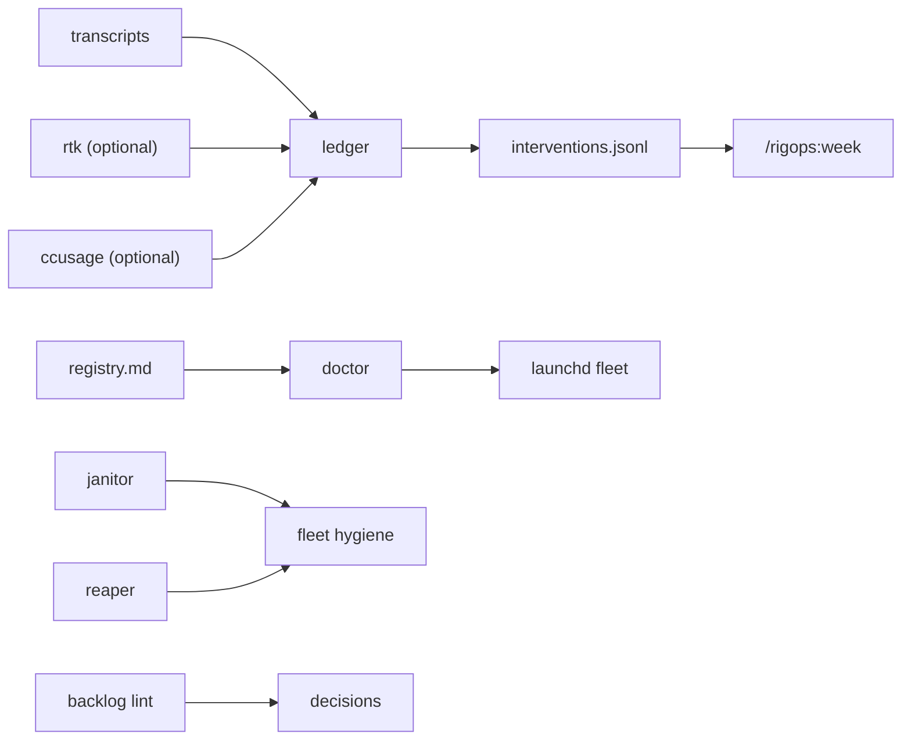

# rigops

Ops layer for a long-running agent rig.

> **Status:** Pre-v1. Under construction, building in public. Scaffold and CI are live; core commands are landing per the roadmap below.

## What works today

- Redaction gate (`make check`): tree + full-history + commit-message scanning, public + private pattern layers.
- Plugin marketplace manifests validate against `claude plugin validate`.
- `make hooks` installs the local commit-message and pre-push redaction gate hooks.

Everything else below is roadmap.

## Positioning

`ccusage` tells you what you spent. rigops tells you whether the change you made last week worked.

Spend dashboards exist. Point-in-time audits exist. Nobody ships week-over-week intervention tracking, config-regrowth-over-time, or launchd/cron automation fleet health for agent rigs — rigops is that missing layer.

rigops is not:

- A spend dashboard (that's `ccusage`'s job)
- An agent framework (it operates the rig around your agents, it doesn't run them)
- A dotfiles dump (one JSON config, not scattered shell exports)

## The four loops

### 1. Ledger

`rigops ledger` *(planned)* writes one append-only row per week, tracking whatever effectiveness levers matter for the rig: cost, latency, intervention count. `rigops ledger note` records an intervention — a prompt change, a new hook, a pruned rule — next to the week it happened. `rigops ledger diff` then shows week-over-week deltas annotated with what you actually changed, so "did that help" gets an answer instead of a guess.

### 2. Tax

`rigops tax` *(planned)* tracks the fixed context tax every rig pays: the bytes of always-loaded config — CLAUDE.md, rules, skill frontmatter — loaded on every single turn whether that turn needs them or not. It's kept as a time series with a per-file breakdown, so regrowth after a pruning pass shows up on a chart instead of staying invisible until the rig feels slow again.

### 3. Doctor

`rigops doctor` *(planned)* reads a plain registry file and reports launchd job fleet health: staleness against each job's expected cadence, hung-job detection with a kill bounded by a max-runtime, and cooldowns on repeated healing attempts so a flapping job doesn't get restarted into the ground.

### 4. Reap, janitor, backlog lint

`rigops reap` *(planned)* reaps git worktrees whose branch has already landed or died. `rigops janitor` *(planned)* applies declarative retention rules instead of ad hoc `rm` one-liners. `rigops backlog lint` *(planned)* enforces one-line-grammar on the backlog file so it stays a queue instead of a dumping ground.

## Map

How data moves from raw agent transcripts to a weekly decision:

## Architecture

Planned design — not yet in the tree:

Two halves, one config. The plugin half will be a Claude Code marketplace plugin — commands, skills, and hooks — with zero daemons, so it degrades gracefully if nothing else is installed. The installed half will be `install.sh`: stdlib-only Python 3.9+ scripts plus hardened launchd templates, for the pieces that need a schedule rather than a prompt. Both halves will read the same JSON config.

Everything will default to read-only. Anything destructive — killing a hung job, removing a worktree, deleting a file — will require an explicit `--apply` flag.

## Extracted from a working rig

These patterns ran daily, unmodified, in a private agent rig for months before this repository existed. Genericizing them is the point of the public build: the example outputs you'll see in docs and tests here are sandbox-generated, not pulled from that rig's real transcripts.

## Pairs with

| Tool | Role |
|---|---|
| [ccusage](https://github.com/ryoppippi/ccusage) | Spend accounting — rigops never re-counts spend |
| [rtk](https://github.com/rtk-ai/rtk) | Token-reduction proxy — optional source for a ledger lever column |
| [engram](https://github.com/xantorres/engram) | Agent memory |
| [repokernel](https://github.com/xantorres/repokernel) | Worktree orchestration |

## Safety

Planned design — not yet in the tree:

Some of this will be destructive by design, so it's worth being upfront about it:

- `doctor` will be able to `SIGTERM` / `SIGKILL` an entire hung-job process group.
- `reaper` will remove git worktrees.
- `janitor` will delete files that match its retention rules.

All of it will be read-only until you pass `--apply`, and every destructive path will have a documented cap.

## Roadmap

- [x] M0 — scaffold, redaction gate, CI (done)
- [ ] M1 — ledger, tax, eit core
- [x] M2 — ledger diff + intervention annotations
- [ ] M3 — doctor
- [ ] M4 — installer
- [ ] M5 — plugin half
- [ ] M6 — reaper, janitor, backlog lint
- [ ] M7 — optional source adapters + auth probe
- [ ] M8 — patterns docs
- [ ] v1

## License

MIT — see [LICENSE](LICENSE).
